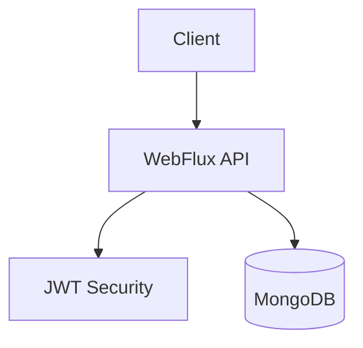

# A&I Report Server (초기 버전)
> **한 줄 소개**: 동아리 과제 운영을 위한 리액티브 기반 리포트/회원 관리 백엔드

## 1. 프로젝트 개요 (Overview)
- **개발 기간**: 2025.03 ~ 진행 중
- **개발 인원**: 백엔드 1명
- **프로젝트 목적**: 리포트 공개/조회/관리 기능과 기본 인증 체계를 구축
- **Repository**: /Users/dh/Desktop/Code/A&I/aandi_post_web_server

## 2. 사용 기술 및 선정 이유 (Tech Stack & Decision)

| Category | Tech Stack | Version | Decision Reason (Why?) |
| --- | --- | --- | --- |
| **Language** | Kotlin | 1.9.25 | DTO/도메인 모델을 명확하게 표현하고 유지보수성을 높이기 위함 |
| **Framework** | Spring Boot WebFlux | 3.4.3 | 비동기 API 처리 기반으로 리포트 서비스 확장 여지 확보 |
| **Database** | MongoDB Reactive | - | 과제 문서 구조를 유연하게 저장하기 위함 |
| **Security** | Spring Security + JWT | jjwt 0.12.5 | 관리자/일반 사용자 접근 권한을 분리하기 위함 |
| **Docs** | SpringDoc OpenAPI | 2.3.0 | 협업 시 API 계약을 명세로 관리하기 위함 |

## 3. 시스템 아키텍처 (System Architecture)

- **설계 특징**:
- `member`, `report`, `common` 패키지 분리
- 리포트 도메인(`Report`, `ReportType`, `Level`)과 DTO 변환 레이어 분리
- Swagger 기반 API 문서 제공

## 4. 핵심 기능 (Key Features)
- **리포트 관리 API**: 생성/조회/수정/삭제
- **진행 중 리포트 조회**: 기간 기준 필터링된 요약 조회
- **회원 인증**: 로그인 및 JWT 발급
- **권한 기반 접근**: 관리자 기능과 일반 조회 기능 분리

## 5. 트러블 슈팅 및 성능 개선 (Troubleshooting & Refactoring)
### 5-1. API 계약 안정성 확보
- **문제(Problem)**: enum/시간 포맷이 일관되지 않으면 프론트 연동 오류 발생 가능
- **원인(Cause)**: 요청 DTO마다 파싱 규칙이 다르면 `reportType`, `level`, 시간대 해석이 불일치
- **해결(Solution)**:
  1. DTO 계층에서 enum과 UTC 시간 변환 규칙 명시
  2. 상세/요약 응답 DTO를 분리해 계약을 고정
- **검증(Verification)**: 잘못된 enum/시간 포맷 요청에 대한 예외 응답 패턴 확인
- **결과(Result)**: 클라이언트 연동 시 파싱 오류 감소, 계약 변경 영향 범위 축소

### 5-2. 권한 정책 명확화
- **문제(Problem)**: 리포트 관리 API에 권한 경계가 약하면 운영 데이터 변경 리스크 증가
- **원인(Cause)**: 쓰기 API와 조회 API가 동일 권한으로 열려 있으면 오용 가능성 증가
- **해결(Solution)**:
  1. Security 설정으로 관리자 전용 경로를 명시
  2. 인증 필터 적용 경로를 분리해 정책 가독성 확보
- **검증(Verification)**: 일반 사용자 토큰으로 쓰기 API 호출 시 차단되는지 확인
- **결과(Result)**: 쓰기 권한 오남용 가능성 감소

## 6. 프로젝트 회고 (Retrospective)
- **배운 점**: 기능 구현과 함께 DTO 계약, 권한 정책을 동시에 설계해야 협업 비용이 줄어듦
- **아쉬운 점 & 향후 계획**: 모니터링/성능 측정 지표를 추가해 운영 안정성을 강화할 계획

## 7. API 명세
- API 요약 문서: `/Users/dh/Desktop/Code/A&I/aandi_post_web_server/docs/API_SPEC.md`
